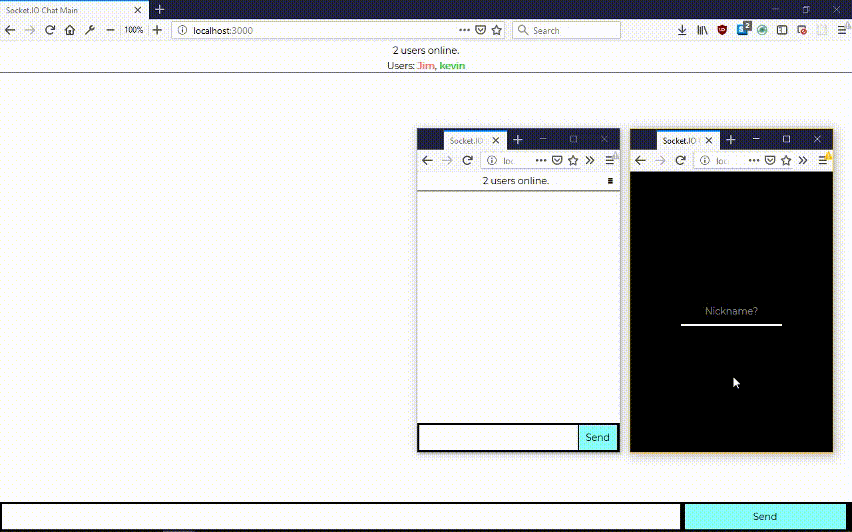

# Instant Chat messaging using [Socket.io](https://socket.io/)
## No databases or OAuth used for this but instead cookies for unique names.

Includes private messaging (can do so by clicking their name at the top of the app). 

Similar to [this](https://glaze-kitchen.glitch.me/) project where I used MongoDB and GitHub OAuth.
